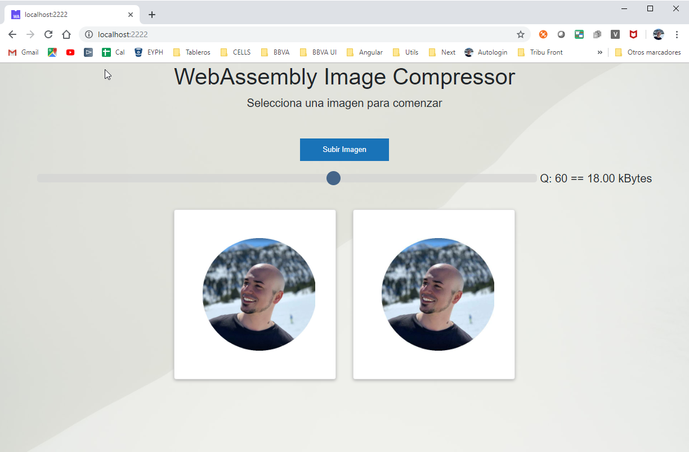

# WASM JPGCompressor

Utilidad que permite comprimir una imagen en el navegador, utilizando un módulo WASM. Este módulo WASM ha sido 
compilado con las librerías C de JPG.
## Instrucciones de uso
1) Agrega una imagen de tipo JPG mediante el botón 'Subir fichero'.
2) A continuación, se muestra un Slider y dos contenedores de imagen.
3) La imagen de la izquierda es la original y la de la derecha es la imagen resultante de la compresión de la misma.
4) Moviendo el Slider se puede seleccionar el tamaño al que queremos comprimir el archivo.
5) Comprimiendo la imagen a la mitad de su tamaño, no se produce una gran pérdida de calidad.

## Instalación
### Arrancando el Servidor
El gestor de paquetes incluido en este proyecto es `yarn`.
Recuerda instalar `yarn` a nivel global para tenerlo disponible en cualquier momento en tu PC.

Para ello, en la consola de tu PC, escribe `npm install yarn --global`

Una vez instalado el gestor de paquetes, es necesario instalar `express`, un servidor de estáticos ligero y rápido.

Para ello ejecuta el comando `yarn`, en la ruta del proyecto. Automáticamente el gestor, localiza el fichero `package.json` y descarga las
dependencias que existan. Finalmente tendremos instalado el servidor de estáticos.

Por último, ejecutar `yarn start` para ver la aplicación escuchando por el puerto `2222`.

### Generación del WASM

El archivo .WASM ya está generado con su `main()` principal y las librerías necesarias. En caso de tener
que realizar una modificación, habría que instalar el entorno específico para la compilación y exportación
de los métodos requeridos.

La documentación de esta Instalación del Entorno será publicada próximamente.

